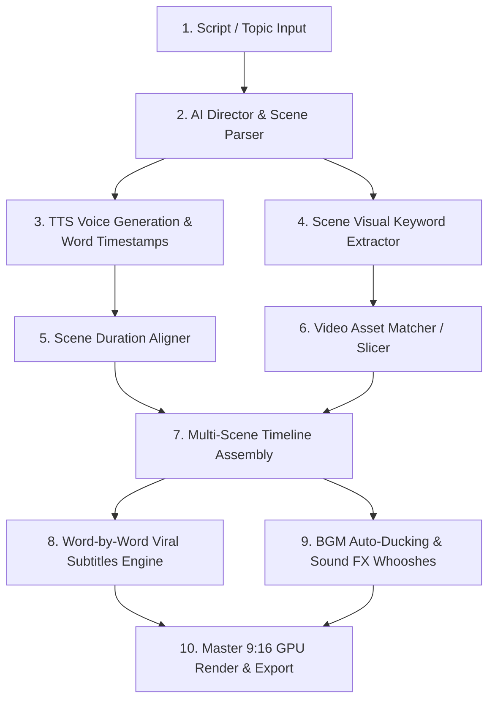

# AI Shorts Studio: TTS Voice Injection & Script-to-Scene Matching

## 1. Executive Feasibility: Is This Possible?
**YES, 100% YES.**
This architecture enables you to input a **Script or Topic**, generate or inject a **Custom Voiceover (TTS)**, automatically parse the narration into **timed scene blocks**, match each scene with **relevant video clips/B-roll**, generate **viral animated subtitles**, apply **dynamic sound FX & BGM auto-ducking**, and render a **master 9:16 Short**.

---

## 2. End-to-End AI Shorts & Voice Generation Workflow



---

## 3. The 4 Core Engines Breakdown

### Engine 1: TTS & Custom Voice Injection (With Word Timestamps)
Provides ultra-realistic neural speech with millisecond-exact word boundaries.
- **Supported Voice Providers**:
  1. **Built-in Neural TTS (`edge-tts`)**: 100% Free, ultra-fast, 100+ realistic voices (Adam, Guy, Christopher, Sonia, Eric, etc.) with exact word-level timestamp metadata.
  2. **ElevenLabs / OpenAI TTS**: Premium voice cloning & studio quality.
  3. **Custom Voice Injection**: Upload any reference MP3/WAV voice audio $\to$ backend extracts speech timing via Whisper/Demucs.
- **Word-Level Subtitle Sync**: Every spoken word has exact `start_time` and `end_time` for viral word-by-word highlighting (Hormozi / MrBeast style).

### Engine 2: Script-to-Scene AI Director
Gemini / LLM analyzes the script and converts it into a structured **Scene Manifest**:
```json
{
  "total_scenes": 4,
  "scenes": [
    {
      "scene_index": 1,
      "narration": "Most people have no idea how deep the ocean actually is.",
      "duration": 3.4,
      "visual_description": "Dark ocean surface diving deep underwater with bioluminescent creatures",
      "visual_keywords": ["deep ocean", "underwater", "dark sea", "ocean abyss"],
      "camera_motion": "slow_zoom_in",
      "sfx": "deep_sub_bass_drop"
    },
    {
      "scene_index": 2,
      "narration": "At 1,000 meters, sunlight completely vanishes into total darkness.",
      "duration": 4.1,
      "visual_description": "Submarine light beam cutting through pitch black water",
      "visual_keywords": ["submarine light", "dark water", "deep abyss"],
      "camera_motion": "punch_zoom",
      "sfx": "sonar_ping"
    }
  ]
}
```

### Engine 3: Scene-to-Video Visual Matching & Slicing
Matches each scene with the best video footage:
1. **User Video Library Mode**: You supply a long video or folder of clips $\to$ the engine cuts and selects the most relevant segments matching each scene's duration.
2. **Auto Stock B-Roll Mode**: Queries free high-def video engines (Pexels / Pixabay API) using the AI visual keywords and downloads 9:16 vertical clips.
3. **AI Video Generation Mode**: Feeds prompts into Runway / Pika / Stable Video APIs.

### Engine 4: Full Shorts Video Editing & Anti-Copyright Suite
Applies all viral editing layers in a single pass:
- **Vertical 9:16 Framing**: Auto-crops or creates blurred video background framing.
- **Dynamic Punch-In Zooms**: Cuts between $1.0\times$ wide shot and $1.15\times$ punch-in on dramatic words.
- **Hormozi-Style Animated Subtitles**: Bold yellow/green highlight on the currently spoken word, black outline, glowing emojis.
- **Multi-Track Audio Mixing**: Narration voice + Lo-Fi/Tension BGM with **Auto-Ducking** (lowers BGM by 75% while speaking) + Sound FX on scene cuts (whooshes, dings, glitches).
- **Video Progress Bar**: Animated timer bar at the top or bottom of the screen.
- **Anti-Copyright Desync**: Pitch adjustment, micro dynamic time-warping, and authentic Apple iPhone EXIF injection.

---

## 4. Technical Implementation Schemas

### Backend Data Schemas (`backend/app/ai_shorts_schemas.py`)
```python
from pydantic import BaseModel, Field
from typing import List, Optional, Literal

class SceneBlock(BaseModel):
    id: str
    scene_index: int
    narration_text: str
    duration_seconds: float = 0.0
    visual_keywords: List[str] = Field(default_factory=list)
    video_source_path: Optional[str] = None   # User clip or downloaded stock
    camera_effect: Literal["none", "slow_zoom_in", "slow_zoom_out", "punch_zoom"] = "slow_zoom_in"
    transition: Literal["cut", "crossfade", "whip_pan", "zoom_blur"] = "cut"
    sfx_trigger: Optional[str] = None         # "whoosh", "pop", "bass_drop", "ding"

class WordTiming(BaseModel):
    word: str
    start: float
    end: float

class AIShortsProject(BaseModel):
    project_id: str
    topic_or_title: str
    script: str
    voice_name: str = "en-US-ChristopherNeural"  # or ElevenLabs voice ID / custom upload
    voice_speed: float = 1.05                     # 0.8x to 1.3x
    voice_pitch: int = 0                          # cents
    bgm_name: str = "phonk_drive"
    bgm_volume: float = 0.20
    ducking_intensity: float = 0.80               # 80% volume drop on voice
    subtitle_style: Literal["hormozi_yellow", "beast_green", "neon_cyan", "minimal_white"] = "hormozi_yellow"
    enable_progress_bar: bool = True
    anti_copyright_shield: bool = True
    scenes: List[SceneBlock] = Field(default_factory=list)
    word_timings: List[WordTiming] = Field(default_factory=list)
```

---

## 5. Visual Studio UI Architecture (`frontend/src/components/aishorts/`)

1. **`AIShortsStudio.jsx`**: Main hub with 3 creation tabs:
   - **Tab 1: Script & Voice Generator** (Enter script $\to$ select neural voice $\to$ generate instant speech preview with waveform).
   - **Tab 2: Scene Storyboard & Media Matcher** (Visual cards for each scene with video slot, keyword tags, camera zoom preview, and replace video button).
   - **Tab 3: Shorts Style & Master Render** (Subtitle themes, BGM picker, sound FX triggers, progress bar color, 1-click Render).
2. **`SubtitleCustomizer.jsx`**: Real-time preview of word-by-word animation with customizable fonts, stroke weight, highlight colors, and emojis.
3. **`SceneCard.jsx`**: Drag-and-drop video replacement, trim adjustment, and preview for individual scene segments.

---

## 6. Implementation Roadmap

| Phase | Milestone | Deliverables |
|---|---|---|
| **Phase 1** | **TTS Voice & Word Alignment Engine** | Integrate `edge-tts` with word boundary timestamps + custom voice upload support. |
| **Phase 2** | **AI Script & Scene Breakdown Engine** | Gemini scene director extracting timed scene blocks, keywords, and SFX triggers. |
| **Phase 3** | **Scene Video Slicer & Media Matcher** | Match user video library or auto-fetch matching 9:16 clips for each scene. |
| **Phase 4** | **Viral Subtitles & Dynamic FX Engine** | Generate ASS/SRT subtitle files with animated word highlight & emoji injection. |
| **Phase 5** | **Master Shorts Multi-Scene FFmpeg Compiler** | Stitch scenes with transitions, punch zooms, audio ducking, and progress bars. |
| **Phase 6** | **Full React Interactive Storyboard UI** | Visual scene storyboard, instant voice tester, and real-time player preview. |
