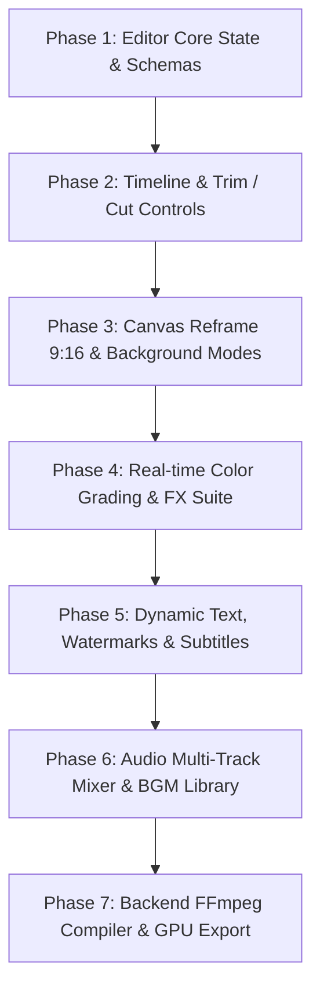

# Video Editing Studio — Full Feature Architecture & Implementation Plan

## 1. Overview & Vision
Transform **CR Remover Studio** from a batch transform/bypass utility into a **High-Performance Creative Video Editing Studio (NLE)**. The editor provides real-time client-side preview with responsive controls (React + HTML5 Canvas/Web Audio), backed by an asynchronous Python + FFmpeg GPU-accelerated rendering engine.

---

## 2. Capability Spectrum: What & How Much Can Be Edited

```
+---------------------------------------------------------------------------------------------------+
|                                 CR REMOVER VIDEO EDITING SUITE                                    |
+--------------------------+-----------------------------+------------------------------------------+
| LEVEL 1: TIMELINE & CUTS | LEVEL 2: CANVAS & REFRAME   | LEVEL 3: VISUAL FX & COLOR               |
| - Non-destructive Trim   | - Smart 9:16/16:9/1:1 Crop  | - Pro Color Wheels & Sliders             |
| - Multi-Segment Split    | - Dynamic Pan & Scan        | - Film Grain, Vignette & LUTs            |
| - Ripple Delete & Reorder| - Blurred / Custom Canvas BG| - Blur Masking & Delogo Eraser           |
| - Speed Ramping (0.2x-4x)| - PiP & Split-Screen Grid   | - 3D Tilt & Chromatic Aberration         |
+--------------------------+-----------------------------+------------------------------------------+
| LEVEL 4: TEXT & CAPTIONS | LEVEL 5: AUDIO & SOUND FX   | LEVEL 6: AI-ASSISTED CREATIVE            |
| - Rich Styled Text Layer | - Multi-track Audio Mixing  | - Auto Silence / Dead-Air Truncation     |
| - Viral Animated Captions| - BGM Library & Auto-Duck   | - Auto Subtitles / Transcription         |
| - Watermarks / Logos     | - 5-Band EQ, Pitch & Shift  | - Face-Tracking Auto-Center Reframe      |
| - Lower Thirds & Badges  | - Demucs Stem Separation    | - AI Thumbnail Frame Generator           |
+--------------------------+-----------------------------+------------------------------------------+
```

---

## 3. Data Model & State Architecture

### A. Video Project Schema (`EditProject`)
```python
from pydantic import BaseModel, Field
from typing import List, Optional, Literal

class ClipSegment(BaseModel):
    id: str
    source_url_or_path: str
    start_time: float = 0.0          # In-point (seconds)
    end_time: float                 # Out-point (seconds)
    playback_speed: float = 1.0     # 0.25 to 4.0
    volume: float = 1.0             # 0.0 to 2.0
    mirror_flip: bool = False
    rotation: int = 0               # 0, 90, 180, 270

class TextOverlay(BaseModel):
    id: str
    text: str
    font_family: str = "Montserrat"
    font_size: int = 48
    font_weight: str = "bold"
    color: str = "#FFFFFF"
    outline_color: str = "#000000"
    outline_width: int = 3
    background_box: bool = True
    background_color: str = "rgba(0,0,0,0.6)"
    x_percent: float = 50.0         # 0-100% canvas X (center-anchored)
    y_percent: float = 80.0         # 0-100% canvas Y (bottom hook/sub)
    start_time: float = 0.0         # Display start timestamp
    end_time: float = 10.0          # Display end timestamp
    animation: Literal["none", "pop", "bounce", "typewriter", "hormozi_glow"] = "pop"

class AudioTrack(BaseModel):
    id: str
    file_path: str
    track_type: Literal["bgm", "sfx", "voiceover"] = "bgm"
    start_offset: float = 0.0       # When in video it starts playing
    volume: float = 0.35            # Master track volume
    duck_on_voice: bool = True      # Auto-duck volume when speech detected
    pitch_cents: int = 0            # -150 to +150
    loop: bool = True

class ColorGrading(BaseModel):
    brightness: float = 0.0         # -1.0 to 1.0
    contrast: float = 1.0           # 0.0 to 2.0
    saturation: float = 1.0         # 0.0 to 3.0
    gamma: float = 1.0              # 0.1 to 3.0
    temperature: float = 0.0        # -100 (Cool Blue) to +100 (Warm Amber)
    vignette: float = 0.0           # 0.0 to 1.0
    film_grain: float = 0.0         # 0.0 to 10.0
    lut_preset: Literal["none", "cyberpunk", "vintage_vhs", "cinematic_teal", "warm_glow", "monochrome"] = "none"

class CanvasSettings(BaseModel):
    aspect_ratio: Literal["9:16", "16:9", "1:1", "4:5", "original"] = "9:16"
    target_width: int = 1080
    target_height: int = 1920
    background_mode: Literal["blurred_video", "solid_color", "gradient", "fit_black"] = "blurred_video"
    background_color: str = "#000000"
    crop_zoom: float = 1.0          # 1.0 to 2.0
    crop_x_offset: float = 0.0      # -50% to +50%

class VideoEditProject(BaseModel):
    project_id: str
    clips: List[ClipSegment]
    canvas: CanvasSettings = Field(default_factory=CanvasSettings)
    color: ColorGrading = Field(default_factory=ColorGrading)
    text_overlays: List[TextOverlay] = Field(default_factory=list)
    audio_tracks: List[AudioTrack] = Field(default_factory=list)
    remove_silence: bool = False
    export_format: Literal["mp4", "mov", "webm"] = "mp4"
    quality_preset: Literal["fast_preview", "high_quality_master", "ultra_4k"] = "high_quality_master"
```

---

## 4. Architectural Components Breakdown

### 1. Frontend Video Studio UI (`frontend/src/components/studio/`)
- **`TimelineEditor.jsx`**:
  - Interactive multi-track timeline with zoomable second grid.
  - Video track with thumbnail filmstrips and draggable trim handles (`[ ]`).
  - Audio track with waveform visualizer.
  - Text & Overlay track with duration bars.
  - Playhead scrubber synced with `<video>` element.
- **`CanvasPreview.jsx`**:
  - HTML5 Canvas overlaying video player.
  - Aspect ratio switcher (9:16 Shorts, 16:9 YouTube, 1:1 Instagram).
  - Draggable & resizable text boxes and watermark repositioning.
  - Real-time CSS Filter / WebGL rendering of color grading & grain for instant feedback without re-rendering.
- **`ToolboxPanel.jsx`**:
  - **Trim & Speed**: Cut, split at playhead, ripple delete, speed slider (0.5x, 1x, 1.25x, 2x).
  - **Color & FX**: Contrast, Brightness, Saturation, Temperature, Film Grain, Vignette, LUT presets.
  - **Text & Captions**: Text styling, Hormozi-style subtitle generator, font selection, animations.
  - **Audio Studio**: Background music selector, volume slider, voice isolation toggle, pitch shift, SFX library.
  - **AI Magic**: 1-click Auto Silence Trimmer, 1-click Auto Subtitle transcription.

### 2. Backend Filter Graph Compiler (`backend/app/editor_engine.py`)
Compiles the `VideoEditProject` JSON into a single-pass, highly optimized FFmpeg complex filtergraph.

#### Example Filter Graph Compilation:
```
# Visual Pipeline: Trim -> Scale/Crop -> Aspect Canvas -> Color Grade -> Grain -> Text/Watermark
[0:v]trim=start=2.5:end=24.0,setpts=PTS-STARTPTS[v_trim];
[v_trim]scale=1080:1920:force_original_aspect_ratio=increase,crop=1080:1920[v_bg_raw];
[v_bg_raw]boxblur=30:5[v_bg];
[v_trim]scale=1080:-2:force_original_aspect_ratio=decrease[v_fg];
[v_bg][v_fg]overlay=(W-w)/2:(H-h)/2[v_canvas];
[v_canvas]eq=contrast=1.12:brightness=0.02:saturation=1.2:gamma=1.05,noise=c1s=3:c1f=t+u[v_graded];
[v_graded]drawtext=text='VIRAL SECRET 🤯':fontfile='fonts/Montserrat-Bold.ttf':fontsize=64:fontcolor=yellow:borderw=4:bordercolor=black:x=(w-text_w)/2:y=h*0.75:enable='between(t,0.5,5.0)'[v_final]

# Audio Pipeline: Trim Audio -> Voice/BGM Mix -> Volume Ducking -> Pitch Shift
[0:a]atrim=start=2.5:end=24.0,asetpts=PTS-STARTPTS,volume=1.0[a_main];
[1:a]aloop=loop=-1:size=2e+09,atrim=0:21.5,volume=0.25[a_bgm];
[a_main][a_bgm]amix=inputs=2:duration=first:dropout_transition=2[a_final]
```

---

## 5. Step-by-Step Implementation Roadmap



### Phase 1: Data Schemas & API Contracts
1. Create `backend/app/editor_schemas.py` defining `VideoEditProject`, `ClipSegment`, `TextOverlay`, `AudioTrack`, `ColorGrading`.
2. Add API endpoints:
   - `POST /api/editor/preview-frame`: Generates a high-res frame at timestamp $T$ with filters applied.
   - `POST /api/editor/render`: Submits render job with real-time WebSocket progress.
   - `GET /api/editor/bgm-library`: Returns curated copyright-safe background music and SFX tracks.
   - `POST /api/editor/auto-subtitles`: Uses Whisper/Gemini to extract timestamped subtitles.

### Phase 2: React Interactive Timeline & Canvas
1. Build `TimelineEditor.jsx` with scrubber, in/out trim handles, segment splitter, and playhead.
2. Build `CanvasPreview.jsx` with responsive aspect ratio container (16:9, 9:16, 1:1) and real-time CSS/WebGL filter pipeline for zero-latency live preview.
3. Synchronize playhead, pause, loop, and playback rate across video and audio tracks.

### Phase 3: Text, Overlays & Subtitle Styler
1. Drag-and-drop text overlay positioning on the preview canvas.
2. Hormozi/MrBeast viral caption presets (Yellow font, Black heavy stroke, Emoji highlight).
3. Custom PNG watermark upload and corner snapping.

### Phase 4: Audio Engine & Anti-Copyright Desync
1. Background music selector with volume ducking when main voice speaks.
2. Pitch shifting (-150 to +150 cents) with tempo lock.
3. AI Vocal Isolation (Demucs stem separation integration).
4. SFX insertion (whoosh, pop, ding).

### Phase 5: Fast Export & FFmpeg GPU Engine
1. Complete `EditorPipeline` in `backend/app/editor_engine.py` to translate full project state into a single-pass FFmpeg command.
2. Support NVENC GPU acceleration (`h264_nvenc`) with CPU fallback (`libx264`).
3. Stream render progress ($0\% \to 100\%$) via WebSockets.
