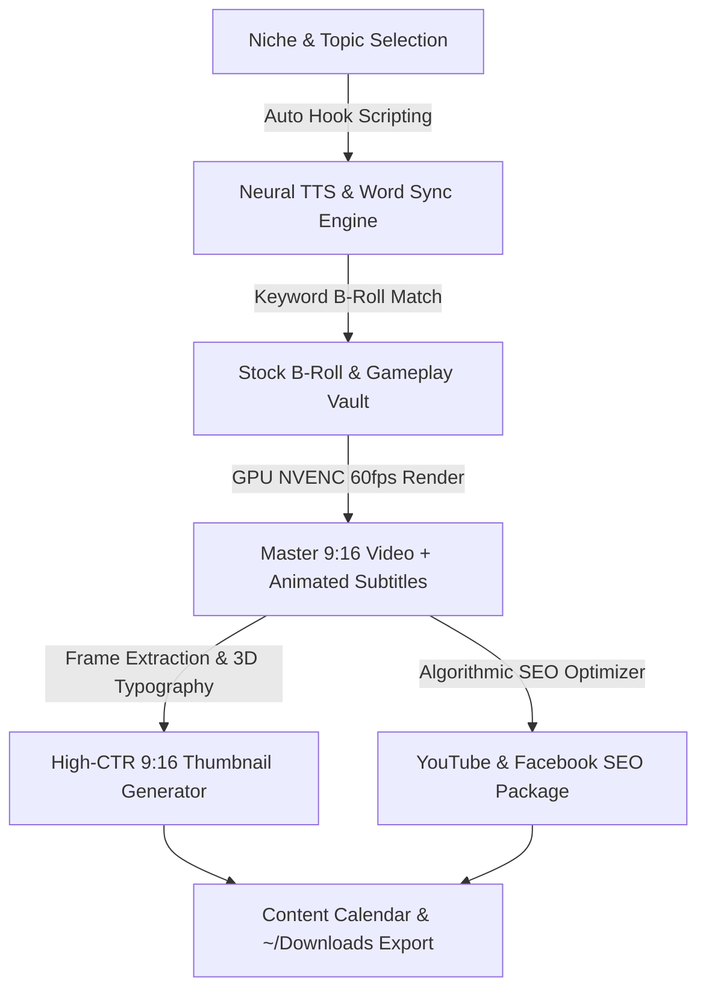

# 🎬 CR Remover Studio v2.0
### *AI Auto-Pilot Shorts Creator & Video Anti-Fingerprint Studio*

[](https://python.org)
[](https://fastapi.tiangolo.com)
[](https://react.dev)
[](https://vitejs.dev)
[](https://ffmpeg.org)
[](https://nvidia.com)
[](https://opensource.org/licenses/MIT)

---

## 📖 Overview

**CR Remover Studio** is an all-in-one autonomous video creation and remixing platform engineered for **YouTube Shorts, Facebook Reels, and TikTok creators**.

It transforms content creation from hours of manual editing into a **1-click automated workflow** — generating viral scripts, synthesizing neural voiceovers, synchronizing word-by-word animated subtitles, matching satisfying B-roll gameplay, generating high-CTR 9:16 thumbnail covers, and producing complete multi-platform SEO packages.



---

## ⚡ Key Features

### 1. 🏭 1-Click 30-Day Channel Auto-Pilot
* **Autonomous Batch Factory:** Generate **3 to 30 ready-to-post Shorts** in a single run.
* **Pre-built Viral Niches:**
  * 🧠 **Dark Psychology & Body Language** (*Manipulation secrets, micro-expressions*)
  * 📜 **Crazy History & Unbelievable Facts** (*Bizarre ancient civilization stories*)
  * ⚔️ **Stoic Motivation & Mental Mastery** (*Marcus Aurelius, discipline*)
  * 👽 **Creepy Unsolved Mysteries** (*Ocean sounds, glitches in reality*)
  * 💰 **Money Hacks & Millionaire Mindset** (*Tax loopholes, wealth rules*)
  * 💬 **Reddit Drama & Petty Revenge** (*r/AskReddit, AITA revenge*)
* **Infinite Retention Loops:** Scripts end on phrases that naturally loop back into the opening hook, maximizing algorithm watch time (>100% retention).

### 2. 🎙️ Neural Voiceover & Microsecond Word Synchronization
* **10+ Curated Studio Voices:** High-fidelity neural TTS models (English US, UK, Australia, India, and Hindi).
* **Word-Level Boundary Timings:** Microsecond-precise timestamps for every spoken word.

### 3. ✍️ Creator Subtitle Styles (ASS Engine)
* **Hormozi Flash:** Vivid yellow highlight (`#FFE600`) with thick black border and pop animation.
* **MrBeast Impact:** High-contrast neon green with drop shadows.
* **Cyber Cyan:** Glowing futuristic cyan text.
* **Crimson Pulse:** Dramatic suspense red style.

### 4. 🎮 Stock B-Roll & Gameplay Vault
* **Curated 9:16 Vertical HD Loops:**
  * Minecraft Parkour (Fast-paced gameplay)
  * Subway Runner (Hypnotic action)
  * Satisfying ASMR (Soap slicing & kinetic fluid)
  * Dark Cyberpunk & Neon Rain
  * Space Galaxy & Cosmic Nebula Vortex
  * Neural Brain Synapses & AI Matrix
  * Luxury Wealth, Supercars & Gold
  * Dark Abyssal Ocean Waves
* **Pexels API & Online Search:** Automatic stock video search matching script keywords.

### 5. 🖼️ High-CTR 9:16 Thumbnail & Cover Studio
* Extracts the sharpest frame from the video.
* Overlays 3D bold typography (`Montserrat-ExtraBold` / `BebasNeue`).
* Colored badge banners (*"🔥 MUST WATCH"*, *"🚨 DON'T IGNORE"*).

### 6. 🏷️ Multi-Platform SEO & Metadata Generator
* **YouTube Shorts:** 3 High-CTR Title choices (<50 chars), 3-sentence keyword SEO description, 10 viral tags, and a **Pinned Comment Question** to spike comment section engagement.
* **Facebook Reels:** Emotional caption, question hook, and viral FB hashtags.
* Automatically writes ready-to-copy `INFO.txt` files alongside each exported video.

### 7. 🛡️ Anti-Copyright Transformation Shield
* Pitch shifting ($-100$ to $+100$ cents) and speed adjustment ($0.8\times$ to $1.5\times$).
* Harmonic notch EQ and vocal isolation (Demucs AI).
* Camera EXIF injection (Apple iPhone 15 Pro metadata spoofing).
* Ken Burns dynamic zoom, subtle film grain, and 3D perspective tilt.

---

## 🖥️ System Requirements & Portability

CR Remover Studio is **100% cross-platform and hardware-agnostic**:

| Requirement | Minimum (Standard Laptop) | Recommended (Fast GPU) |
| :--- | :--- | :--- |
| **Operating System** | Linux (Ubuntu/Debian), Windows 10/11, macOS | Ubuntu Linux 22.04+ / Windows 11 |
| **Processor (CPU)** | Intel Core i3 / AMD Ryzen 3 (Dual-Core) | AMD Ryzen 5 / Intel Core i5/i7 (6+ Cores) |
| **Graphics (GPU)** | Not required (uses CPU `libx264`) | NVIDIA GTX 1050+ / RTX 2060+ (NVENC) |
| **Memory (RAM)** | 4 GB | 8 GB – 16 GB |
| **Dependencies** | Python 3.10+, FFmpeg | Python 3.12, Node.js 18+, FFmpeg |

---

## 🚀 Quick Start Guide

### 1. Clone the Repository
```bash
git clone https://github.com/HARSHIT-1NAGAR/cr-remover-studio.git
cd cr-remover-studio
```

### 2. Install System Dependencies

#### **Ubuntu / Debian Linux:**
```bash
sudo apt update
sudo apt install -y ffmpeg python3-venv python3-pip nodejs npm
```

#### **macOS (Homebrew):**
```bash
brew install ffmpeg python node
```

#### **Windows:**
1. Install [Python 3.12](https://www.python.org/downloads/) (check "Add Python to PATH").
2. Install [FFmpeg](https://ffmpeg.org/download.html) and add its `bin` folder to your System PATH.
3. Install [Node.js](https://nodejs.org/).

---

### 3. Setup Python Backend
```bash
# Create virtual environment
python3 -m venv venv

# Activate virtual environment
# On Linux/macOS:
source venv/bin/activate
# On Windows:
# .\venv\Scripts\activate

# Install dependencies
pip install -r requirements.txt
```

---

### 4. Setup React Frontend
```bash
cd frontend
npm install
npm run build
cd ..
```

---

### 5. Launch the Studio!

#### **Option A: 1-Click Launch Script (Linux/macOS)**
```bash
./start.sh
```

#### **Option B: Manual Launch**
```bash
# Start Backend (serves UI + API on http://localhost:8000)
source venv/bin/activate
python backend/run.py
```

Open your browser and navigate to **[http://localhost:8000](http://localhost:8000)** (or Vite live dev server at **[http://localhost:5173](http://localhost:5173)**).

---

## ⚙️ Optional Environment Variables

Create a `.env` file in the project root to enable AI cloud superpowers (all modules have offline procedural fallbacks if keys are not provided):

```env
# Optional: Google Gemini API for deep script & SEO generation
GEMINI_API_KEY=your_gemini_api_key_here

# Optional: Pexels API for live online stock video searching
PEXELS_API_KEY=your_pexels_api_key_here
```

---

## 📁 Project Structure

```
cr-remover-studio/
├── backend/
│   ├── app/
│   │   ├── main.py                 # FastAPI server & WebSocket manager
│   │   ├── batch_autopilot.py      # 1-Click 30-Day Channel Auto-Pilot engine
│   │   ├── broll_harvester.py      # Stock B-roll & Gameplay vault
│   │   ├── thumbnail_generator.py  # 9:16 High-CTR Cover designer
│   │   ├── meta_generator.py       # YouTube & Facebook SEO optimizer
│   │   ├── reddit_generator.py     # Reddit drama & UI card maker
│   │   ├── tts_engine.py           # Neural TTS & ASS subtitle compiler
│   │   ├── scene_director.py       # Scriptwriting & scene breakdown
│   │   ├── editor_engine.py        # 9:16 Master Shorts GPU rendering engine
│   │   ├── pipeline.py             # Anti-Copyright transformation pipeline
│   │   ├── audio_engine.py         # Pitch, EQ, and harmonic filters
│   │   ├── config.py               # Hardware NVENC & directory detection
│   │   └── editor_schemas.py       # Pydantic v2 data models
│   ├── storage/
│   │   ├── uploads/                # Staged uploaded media
│   │   ├── processed/              # Rendered master videos
│   │   ├── temp/                   # Intermediate audio/subtitles
│   │   └── assets/                 # Fonts, BGM, SFX, and B-Roll loops
│   └── run.py                      # Backend launcher entrypoint
├── frontend/
│   ├── src/
│   │   ├── components/
│   │   │   ├── AutoPilotStudio.jsx # Batch factory, calendar, b-roll & covers
│   │   │   ├── AIShortsStudio.jsx  # Single Short deep editor
│   │   │   ├── AutoViralStudio.jsx # 1M+ Shorts viral hunter
│   │   │   ├── Header.jsx          # Mode navigation & hardware badge
│   │   │   ├── UploadZone.jsx      # Video upload & URL downloader
│   │   │   └── TransformSettings.jsx # Anti-copyright sliders
│   │   ├── App.jsx                 # Main React container
│   │   └── index.css               # Design tokens & dark cyber theme
│   ├── package.json
│   └── vite.config.js
├── requirements.txt                # Python dependencies
├── start.sh                        # 1-Click startup script
└── README.md                       # Documentation
```

---

## 🤝 Contributing

Contributions, issues, and feature requests are welcome! Feel free to check the [issues page](https://github.com/HARSHIT-1NAGAR/cr-remover-studio/issues).

1. Fork the Project
2. Create your Feature Branch (`git checkout -b feature/AmazingFeature`)
3. Commit your Changes (`git commit -m 'Add some AmazingFeature'`)
4. Push to the Branch (`git push origin feature/AmazingFeature`)
5. Open a Pull Request

---

## 📄 License

Distributed under the **MIT License**. See `LICENSE` for more information.

---

<p align="center">
  <b>Built with ❤️ for Content Creators worldwide.</b>
</p>
